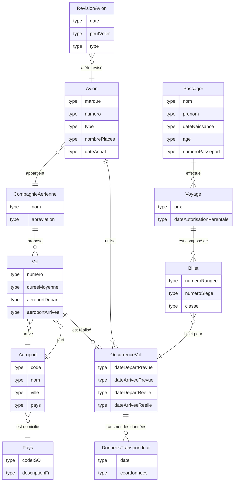

# TP1 - Réservation de billets d'avions

## 1 - Directives

### 1.1 - Déroulement du TP

- Remise du travail: dimanche 3 mai 2026, 23:59
- Ce travail est réalisé en équipe de 2 personnes et seuls les membres de cette équipe y contribuent
- Toutes les réponses fournies doivent être originales (produites par l’étudiant ou un membre de l’équipe)
- Toute copie de code, de portion de code, d’algorithme ou de texte doit faire mention de sa source
- L’emprunt ou la copie de code ou de portions de code est interdite
- Tout constat de plagiat, tricherie ou fraude sera automatiquement déclaré à la Direction et les sanctions prévues seront appliquées
- L'utilisation de l'IA et de toutes autres sources est considérée comme du plagiat si non documentée en tant que source (Si ce n'est pas dans votre cours, c'est qu'il faut une référence). Par exemple, si vous utilisez une requête trouvée sur StackOverflow, vous devez faire un commentaire dans votre code indiquant que vous avez utilisé cette requête et fournir un lien vers la source. Si vous utilisez une requête générée par une IA, vous devez faire un commentaire dans votre code indiquant que vous avez utilisé une IA pour générer cette requête et fournir le lien de partage de la discussion avec l'IA. 
- Toute source externe au matériel du cours doit être explicitement documentée ou sera considéré comme du plagiat
- Vous devez utiliser votre dépôt Git pour faire votre travail : si une situation particulière est détectée, vos commits moduleront votre note dans le groupe et peut même aller jusqu'à un zéro en cas de non participation. (Attention à l'utilisation de 4 mains sur un compte Git !)
- Durée : 3 x 3 heures + travail à la maison
- Plate forme : Microsoft SQL Server, GitHub, Visual Studio Code

### 1.2 - À remettre sur la plateforme d'enseignement Léa

Vous devez simplement archiver le contenu de votre dépôt Git qui devrait contenir tous ces éléments au moment de la remise.

## 2 - Contexte

Vous devez créer une première version d'une base de données permettant de modéliser des voyages en avions. Un voyage peut être composé d'un ou plusieurs billets. Un billet est associé à une occurrence de vol.

Voici l'ERD qui vous a été fourni par votre analyste :

Votre analyste vous a indiqué que deux informations ne sont pas forcément renseignées :

- il n'y a pas de numéro de passeport pour les vols intérieurs
- la date d'autorisation parentale est seulement requise pour les mineurs

Une lecture rapide du diagramme peut se résumer ainsi :

- Un voyage est composé d'un ou plusieurs billets (étapes). Un billet est associé à une occurrence de vol. Un voyage peut être un aller simple ou un aller-retour. Quand on parle de temps de vol, on parle du temps de vol cumulé estimé. La durée d'un voyage est la durée entre le départ du premier vol et l'arrivée du dernier vol. (Réelle ou estimée si le voyage n'est pas terminé). La durée de vol est la somme des durées de vol de chaque étape sans compter les durées entre les vols.
- Une occurrence de vol est associée à un vol. L'occurrence de vol est le vol réel. Le vol est la définition du vol (numéro, aéroport de départ, aéroport d'arrivée) et il peut donc y avoir plusieurs occurrence de ce vol à des dates différentes.

L'ERD fourni est un point de départ. Vous devez le transformer en modèle relationnel complet en ajoutant les identifiants, les clefs primaires, les clefs étrangères, les contraintes, les types de données. Toute modification ou précision apportée au modèle fourni doit être justifiée en commentaire SQL.

## 3 - À réaliser

- Modifier le fichier `AUTHORS.md` pour y inscrire les noms complets des deux membres de l’équipe ainsi que le numéro de l'équipier. (-10 points si non fait)
- Compléter le modèle relationnel à partir de l'ERD fourni (Copiez la section Mermaid dans le fichier `ERD_COMPLETE.md` pour ajouter les éléments demandés dans la section Mermaid ci-dessus) :
  - Ajouter les clefs primaires / étrangères (5 points) (Équipier 1)
  - Déduire les types de données (5 points)  (Équipier 2)
- Justifier, en commentaires dans le fichier de création des tables, le type/colonne de clefs primaires que vous avez choisi (Colonne déjà présente, ajout d'une colonne, utilisation d'un VARCHAR/UNIQUEIDENTIFIER/INT/Composées) (5 points) (Équipier 1)
- Ajouter des index où cela est approprié (5 points) (Équipier 2)
- Script SQL permettant d'implanter l'ERD (10 points) (Équipier 1)
- Créer des données de test (10 points) (Équipier 2) : les données doivent s'adapter à la date de l'exécution du script, c'est-à-dire que les données de test doivent être créées en fonction de la date d'exécution du script. Par exemple, si vous créez une occurrence de vol pour dans 9 jours, elle doit être créée pour la date d'exécution du script + 9 jours. De même, si vous créez une occurrence de vol pour il y a 15 jours, elle doit être créée pour la date d'exécution du script - 15 jours. (Attention à l'utilisation de fonctions de date dans votre script pour que les données soient créées en fonction de la date d'exécution du script)
- Écrire les requêtes suivantes :
  1. Afficher l'ensemble des vols ayant au moins une occurrence future pour chaque compagnie aérienne (5 points)  (Équipier 1)
  2. Afficher les pays par ordre descendant du nombre d'aéroports (5 points) (Équipier 2)
  3. Afficher l'ensemble des vols qui n'ont pas eu d'occurrence depuis plus de 60 jours (5 points) (Équipier 1)
  4. Afficher le nombre de passagers pour une occurrence de vol donnée (5 points) (Équipier 2)
  5. Afficher les étapes d'un voyage pour un passager donné (5 points) (Équipier 1)
  6. Afficher les étapes de voyage pour un client avec une numérotation des étapes dans l'ordre et l'addition des durées en vol (hors temps de transit) estimées à la fin de l'étape courante (10 points) (Équipier 2)
  7. Afficher le voyage le plus long pour le mois courant. Un voyage est considéré dans le mois courant si son premier billet à une date de départ prévue dans le mois (5 points) (Équipier 1)
  8. Afficher la liste des voyages actifs pendant la journée courante, c’est-à-dire les voyages dont le premier vol a déjà débuté ou débute aujourd’hui, et dont le dernier vol se termine aujourd’hui ou plus tard. (5 points) (Équipier 2)
  9. Afficher le nombre de voyageurs pour la journée courante et un aéroport précis  (5 points) (Équipier 1)
  10. Afficher les voyages dont le dernier vol n’est pas encore terminé, incluant les voyages qui n’ont pas encore débuté. (ie il peut ne pas avoir débuté) (5 points) (Équipier 2)
  11. Afficher le nombre de voyageurs ayant un et un seul billet pour un voyage intérieur (Donc une étape) pour une date précise (année, mois et jour). Un voyage intérieur est un voyage dont l’aéroport de départ et l’aéroport d’arrivée sont situés dans le même pays. (5 points) (Équipier 1)

Répartition indicative des points :

- Total : 100 points
- Équipier 1 : 50 points
- Équipier 2 : 50 points

Cette répartition considère que la requête 11 est attribuée à l'équipier 1. Même si l'équipier 2 a une requête de moins, la requête 6 vaut 10 points, ce qui donne 30 points de requêtes à chaque équipier. La tâche « Compléter le modèle relationnel à partir de l'ERD fourni » regroupe les points associés aux clefs primaires / étrangères et aux types de données.

## 4 - Structure attendue des fichiers SQL

Les scripts SQL doivent être placés dans le répertoire `src/SQL` et être organisés ainsi :

- `00_drop.sql` : suppression des tables pour permettre une réexécution complète;
- `01_modele_relationnel.sql` : création du modèle relationnel complet, incluant les tables, clefs, contraintes et commentaires de justification;
- `02_donnees_test.sql` : insertion des données de test;
- `03_index.sql` : création des index;
- `04_requetes_equipier1.sql` : requêtes 1, 3, 5, 7, 9 et 11;
- `05_requetes_equipier2.sql` : requêtes 2, 4, 6, 8 et 10.

Les scripts doivent pouvoir être exécutés dans cet ordre sans modification manuelle.

## 5 - Contraintes

- N'oubliez pas de respecter les nomenclatures demandées en cours
- Optimisez vos requêtes
- Partage entre équipier de code avec Git
- Remise finale sur Léa
- L'évaluation tient compte :
  - du style et de la structure du code : elle doit être similaire à celle proposée en cours
  - des pratiques de programmation apprises dans le programme doivent être appliquées
  - de la participation de chaque coéquipier : les commits de chaque membre de l'équipe seront observés, mais ne seront pas représentatifs de l'évaluation de la participation. S'il y a un quelconque problème de collaboration entre les membres de l'équipe, s.v.p. adressez-vous directement au professeur et celui-ci prendra les mesures appropriées.

Tout partage de code, d'explication, de bouts de texte, etc. est considéré comme du plagiat. Pour plus de détails, consultez le site (et ses vidéos) [Sois intègre du Cégep de Sainte-Foy](http://csfoy.ca/soisintegre) ainsi que [l'article 6.1.12 de la PÉA](https://www.csfoy.ca/fileadmin/documents/notre_cegep/politiques_et_reglements/5.9_PolitiqueEvaluationApprentissages_2019.pdf)

## Contribution

- Les listes des aéroports et des pays sont disponibles dans le fichier excel liste_aeroports_pays.xls.
