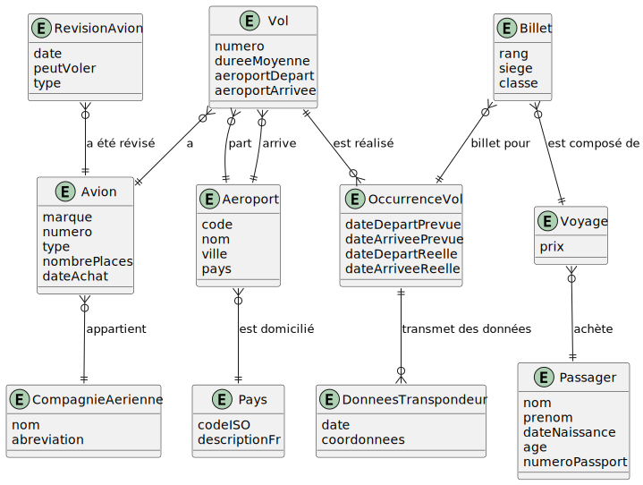

# TP1 - Réservation de billets d'avions

## 1 - Directives

### 1.1 - Déroulement du TP

- Remise du travail: dimanche 26 novembre 2023, 23:59
- Ce travail est réalisé en équipe de 2 personnes et seuls les membres de cette équipe y contribuent
- Toutes les réponses fournies doivent être originales (produites par l’étudiant ou un membre de l’équipe)
- Toute copie de code, de portion de code, d’algorithme ou de texte doit faire mention de sa source
- L’emprunt ou la copie de code ou de portions de code est interdite
- Tout constat de plagiat, tricherie ou fraude sera automatiquement déclaré à la Direction et les sanctions prévues seront appliquées
- Vous devez utiliser votre dépôt Git pour faire votre travail : si une situation particulière est détectée, vos commits moduleront votre note dans le groupe et peut même aller jusqu'à un zéro en cas de non participation. (Attention à l'utilisation de 4 mains sur un compte Git !)
- Durée : 3 x 3 heures + travail à la maison
- Plate forme : Microsoft SQL Server, GitHub, Visual Studio Code

### 1.2 - À remettre sur la plateforme d'enseignement Léa

- Votre code source SQL dans le répertoire src/SQL sur Git
- Le contenu de ce répertoire zippé sur Léa avant la date indiquée

En résumé, vous pouvez simplement archiver le contenu de votre dépôt Git qui devrait contenir tous ces éléments au moment de la remise.

## 2 - Contexte

Vous devez créer une première version d'une base de données permettant de modéliser des voyages en avions. Un voyage peut être composé d'un ou plusieurs billets. Un billet est associé à une occurrence de vol.

Voici l'ERD qui vous a été fourni par votre analyste :



Votre analyste vous a indiqué que deux informations ne sont pas forcément renseignées :

- il n'y a pas de numéro de passport pour les vols intérieurs
- la date d'autorisation parentale est seulement requise pour les mineurs

Une lecture rapide du diagramme peut se résumer ainsi :

- Un voyage est composé d'un ou plusieurs billets (étapes). Un billet est associé à une occurrence de vol. Un voyage peut être un aller simple ou un aller-retour. Quand on parle de temps de vol, on parle du temps de vol cumulé estimé. La durée d'un voyage est la durée entre le départ du premier vol et l'arrivée du dernier vol. (Réelle ou estimée si le voyage n'est pas terminé). La durée de vol est la somme des durées de vol de chaque étape sans compter les durées entre les vols.
- Une occurrence de vol est associée à un vol. L'occurrence de vol est le vol réel. Le vol est la définition du vol (numéro, aéroport de départ, aéroport d'arrivée) et il peut donc y avoir plusieurs occurrence de ce vol à des dates différentes.

## 3 - À réaliser

- Modifier le fichier AUTHORS.md (-10 points si non fait)
- Ajouter les clefs primaires / étrangères (5 points)
- Justifier, en commentaires, le type de clefs que vous avez choisi (5 points)
- Ajouter des index où cela est approprié (5 points)
- Déduire les types de données (5 points)
- Script SQL permettant d'implanter l'ERD (10 points)
- Créer des données de test (10 points)
- Écrire les requêtes suivantes :
  1. Afficher l'ensemble des vols disponibles pour chaque compagnie aérienne (5 points)
  2. Afficher les pays par ordre descendant du nombre d'aéroports (5 points)
  3. Afficher l'ensemble des vols qui n'ont pas eu d'occurrence depuis plus de 60 jours (5 points)
  4. Afficher le nombre de voyageurs pour une occurrence de vol donnée (5 points)
  5. Afficher les étapes d'un voyage pour un client donné (5 points)
  6. Afficher les étapes de voyage pour un client avec une numérotation des étapes dans l'ordre et l'addition des durées en vol (hors temps de transit) estimées à la fin de l'étape courante (10 points)
  7. Afficher le voyage le plus long pour le mois courant. Un voyage est considéré dans le mois courant si son premier billet à une date de départ prévue dans le mois (5 points)
  8. Afficher la liste des voyages pour la journée courante (ie qui débute ou a débuté le voyage et qui fini le voyage aujourd'hui ou va finir le voyage plus tard) (5 points)
  9. Afficher le nombre de voyageurs pour la journée courante et un aéroport précis  (5 points)
  10. Afficher les voyages non terminés (ie il peut ne pas avoir débuté) (5 points)
  11. Afficher le nombre de voyageurs ayant un et un seul billet pour un voyage intérieur (Donc une étape) pour une date précise (année, mois et jour) (5 points)

## 4 - Contraintes

- N'oubliez pas de respecter les nomenclatures demandées en cours
- Optimisez vos requêtes
- Partage entre équipier de code avec Git
- Remise finale sur Léa

Tout partage de code, d'explication, de bouts de texte, etc. est considéré comme du plagiat. Pour plus de détails, consultez le site (et ses vidéos) [Sois intègre du Cégep de Sainte-Foy](http://csfoy.ca/soisintegre) ainsi que [l'article 6.1.12 de la PÉA](https://www.csfoy.ca/fileadmin/documents/notre_cegep/politiques_et_reglements/5.9_PolitiqueEvaluationApprentissages_2019.pdf)

## Contributions

- Liste des aéroports : extrait de https://portail-portal.otc-cta.gc.ca/fr/liste-aeroports-internationaux avec JS :

```JS
a.filter(aa => aa.active).map(aa => { return {iata: aa.iata, nom: aa.nameFr, latitude: aa.latitude,longitude:aa.longitude, ville:aa.city.nameFr, pays:aa.city.country.nameFr };}).map(aa => [aa.iata, aa.nom, aa.latitude, aa.longitude, aa.ville, aa.pays].join(";")).join("\n")
```

- Liste pays : extrait de https://fr.wikipedia.org/wiki/ISO_3166-1

Ces listes sont disponibles dans le fichier excel liste_aeroports_pays.xls
